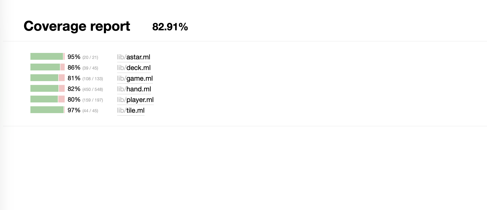

# ocaml_mahjong

Zeli Ma, Jiewen Luo, Jin Zhou

Japanese mahjong implemented with OCaml, for FPSE 2025Fall

## Project Overview

This project aims to develop a comprehensive Japanese Mahjong application using OCaml. The primary goal is to build a game engine that correctly implements the complex rules of Riichi Mahjong.

A core feature of this project is an advanced AI and analysis module. This module is powered by an A* search algorithm designed to evaluate hand efficiency (i.e., *shanten*, or steps to a winning hand) and determine the optimal discard choice in any given situation.

The final application serves multiple purposes:

* **AI Opponents:** AI opponents with multiple difficulty levels (Easy / Medium / Hard) that can be switched in the UI.
* **A Training Tool:** A system to analyze player decisions and provide optimal play recommendations.
* **Libraries used:** `ounit2`, `dream`, `core`.

### Basic Game Concepts

* **Riichi Mahjong**  
  A Japanese variant of Mahjong, usually played by 4 players. Each player draws and discards tiles, trying to form a complete hand (similar to making sets in rummy).

* **Hand / Winning Hand**  
  A Mahjong **hand** is the set of tiles a player holds.  
  A **winning hand** usually consists of:
  * 4 **melds** (sets) + 1 **pair** (two identical tiles),  
    for example: 3-4-5 of the same suit (a sequence) or 7-7-7 (a triplet), plus one pair like 2-2.

* **Meld**  
  A group of 3 or 4 tiles that form a valid set:
  * **Sequence (shuntsu)** – three consecutive numbers in the same suit (e.g., 3-4-5 of circles).
  * **Triplet (koutsu)** – three identical tiles (e.g., 7-7-7 of bamboo).
  * **Quad (kan)** – four identical tiles (e.g., 9-9-9-9 of characters).

* **Tatsu**  
  An **incomplete set** that is one tile away from becoming a meld.  
  Examples:
  * A **sequence wait**: 2-3 of a suit (needs 1 or 4 to become 1-2-3 or 2-3-4).
  * A **pair-like wait**: 5-5 (needs another 5 to become a triplet).

### Key Japanese Action Terms

These actions are available when certain tiles are discarded or drawn:

* **Chi (chii)**  
  Calling a sequence from the **player on your left** using their discard.  
  Example: You have 3-4 of circles, the player on your left discards 5 of circles → you can call **chi** to make 3-4-5.

* **Pon**  
  Calling a **triplet** from any player’s discard.  
  Example: You have two 7 of bamboo, someone discards another 7 of bamboo → you can call **pon** to make 7-7-7.

* **Kan**  
  Making a **quad (four of a kind)**. This can come from:
  * Upgrading a triplet you already have when you draw the 4th tile, or
  * Calling on another player’s discard if you have three copies.

* **Tsumo**  
  Winning by drawing the winning tile **yourself** from the wall.

* **Ron**  
  Winning by claiming a tile **discarded by someone else**.

These are the buttons you see in the UI: `chi`, `pon`, `kan`, `tsumo`, and `ron`.

### Tile Types and Names

Japanese Mahjong uses tiles instead of playing cards. There are 34 unique tile types, with 4 copies of each (136 tiles total). They are grouped into:

* **Numbered Suits (1–9 in each suit):**
  * **Characters / Manzu (“man”“万”)** – often written with Chinese numerals (一 to 九).  
    Example: “1-man”, “9-man”.
  * **Circles / Pinzu (“pin”“筒”)** – circles/dots.  
    Example: “3-pin”, “7-pin”.
  * **Bamboo / Souzu (“sou”“索”)** – sticks/bamboo.  
    Example: “2-sou”, “6-sou”.

* **Honor Tiles:**
  * **Winds:** East“东”, South“南”, West“西”, North“北”.
  * **Dragons:** White“白”, Green“发”, Red“中”.

In code, we treat each unique tile (e.g., 3-pin, East wind) as an element in a fixed list of 34 tile types and store how many copies you have.

### Shanten, Tenpai, and Ukeire

These are key concepts for our AI and analysis tools.

* **Shanten**  
  *Shanten* is “how many steps away from a winning hand” you are.  
  * **shanten = 0** → your hand is in **tenpai**, one tile away from winning.  
  * **shanten = 1** → you need at least 2 more tile improvements to win, and so on.  
  * If you are already winning, the shanten value can be thought of as -1.

  Our algorithm computes this number for the current hand.

* **Tenpai**  
  A hand that is **ready**—it only needs one more tile to win (shanten = 0).

* **Ukeire (effective tiles)**  
  Literally “accepted tiles.”  
  For a given hand, **ukeire** is the **set and count of tiles that improve your hand**:
  * Given your current tiles, we imagine drawing each possible tile type.
  * If drawing that tile reduces shanten, it is an **effective tile**.
  * The total number of such tiles still left in the wall is the **ukeire count**.
  * A higher ukeire count = more ways to improve your hand = “better efficiency.”

Our AI uses **ukeire** to rank discards: it recommends discarding the tile that leaves you with the highest ukeire count.

## Implemented Yaku

This section summarizes the Riichi Mahjong **yaku (役)** currently implemented in the `ocaml_mahjong` project.  
All **yaku detection** logic lives in the `Score` type and the `check_*` family of functions in `lib/hand.ml`.  
The current UI does **not** implement a full point-scoring system (han/fu → points), but yaku information is available for analysis and for the Hard-level AI.

For precise, official definitions of each yaku, please refer to the “Yaku and han values” section in the *Japanese mahjong scoring rules* article on Wikipedia:  
[https://en.wikipedia.org/wiki/Yaku_(Japanese_mahjong)](https://en.wikipedia.org/wiki/Yaku_(Japanese_mahjong))

### Tile Notation in Examples (when used)

- `m`: **Manzu** (万子 / characters)  
- `p`: **Pinzu** (筒子 / circles)  
- `s`: **Souzu** (索子 / bamboo)  
- `z`: **Honors**  
  - `1–4z`: East, South, West, North (东南西北)  
  - `5–7z`: Haku, Hatsu, Chun (白发中)

### Implemented Yaku Categories

We implement the following groups of yaku; each name below corresponds directly to a constructor in `Score.yaku`:

1. **Situational & “luck” yaku**  
   - `MenzenTsumo`, `Riichi`, `Ippatsu`, `Rinshan`, and `Dora of int` (dora are treated as bonus han, not a standalone yaku in official rules, but they are tracked in our `Score.yaku` type).

2. **Number / honor–restricted yaku**  
   - **Tanyao (All Simples)** – no terminals (1/9) and no honors.  
   - **Yakuhai (Value Tiles)** – triplets/quads of dragons or round/seat wind, represented as `Yakuhai of string`.  
   - **Honroutou (All Terminals & Honors)** – only terminals and honors.  
   - **Chanta / Junchan** – every set contains terminals (with or without honors).

3. **Sequence & triplet pattern yaku**  
   - **Pinfu** – all sequences, “peaceful” hand.  
   - **Iipeiko / Ryanpeiko** – one or two sets of identical sequences.  
   - **Toitoi** – all triplets/quads.  
   - **Sanankou / Sankantsu** – three concealed triplets or three quads.  
   - **Shousangen** – two dragon triplets plus one dragon pair.  
   - **Sanshoku Doukou / Sanshoku (Doujun)** – same number across three suits, as triplets or sequences.  
   - **Itsu (Ikkitsuukan)** – 123 + 456 + 789 straight in one suit.

4. **Flush-type yaku**  
   - **Honitsu** – one suit plus honors.  
   - **Chinitsu** – one suit, no honors.

5. **Special-hand structure**  
   - **Chiitoitsu (Seven Pairs)** – seven distinct pairs; handled by a dedicated shanten calculator.

In practice, these yaku are primarily used for:
* offline / unit-test verification of our scoring logic, and  
* designing heuristics for the Hard-level AI (preferring shapes that move towards Tanyao, Honitsu/Chinitsu, Yakuhai, and dora-rich hands).

## How to play

* `dune exec bin/main.exe` to start, run on `localhost:3000`.
* Click tiles to select them; click operation buttons to perform `chi`, `pon`, `kan`, `tsumo`, and `ron`.
* Play with 3 AI bots. In the UI, you can switch each bot between **Easy / Medium / Hard** logic (random play vs. pure A*-based efficiency vs. enhanced A* with yaku-aware heuristics).

* Use the built-in **AI assistant** to see recommended discards and their contribution to shanten / efficiency.

* To test the new standalone frontend, use `npx http-server . -p 8080` and open `http://127.0.0.1:8080`.

## Finished functions

* Based on the `.mli` files, we developed the core structure including fundamental functions: `draw`, `play` (discard), and `win` (basic win check) and operations: `chi`, `pon`, `kan`, and `ron`.
* Basic frontend interface written with `HTML` and `Dream`.
* A complex algorithm to calculate **shanten** and tile efficiency, which gives players recommendations on what to discard by showing the contribution to shanten.  
  It is implemented as an **A\*-based search** over the hand-decomposition state space (frequency table over 34 tile types), combined with **ukeire** (effective-tile) counting, and achieves comparable behavior to existing online tools such as `mj.fyisvia.com/discard`.

## Implementation

### Backend

* All game logic is encapsulated in the `Mahjong` library, ensuring it is reusable and testable without the frontend.

* **tile**  
  Defines the basic types of Mahjong tiles (`suit`, `honor`, `t`) and implements operations like `compare` and `to_string` for internal use.

* **deck**  
  Defines the deck (wall) from which players draw tiles.
  * Creates the full 136-tile set and reserves 14 tiles for the dead wall.
  * Handles shuffling, drawing, rinshan draw, and tracking dora indicators.

* **hand**  
  Implements all operations on a single player’s closed hand, as well as shanten and efficiency analysis:
  * Maintains hands as a list of tiles and exposes helpers like sorting and frequency-table conversion.
  * Computes **standard shanten** via an **A\*** search:
    * Represents the hand as a 34-length frequency array.
    * A search state contains:
      * the tile counts,  
      * the current tile index `idx`,  
      * `remaining` (tiles not yet assigned to any structure),  
      * `melds` (complete sets),  
      * `tatsu` (incomplete sets),  
      * `has_head` (whether the pair has been chosen).
    * From this state, A\* branches over:
      * discarding a single tile at `idx` (skip / waste),  
      * forming a triplet or sequence (meld, cost -2),  
      * selecting the head (pair, cost -1),  
      * forming a tatsu (pair-like or proto-sequence, cost -1).
    * The cost function starts at `g = 8` and decreases as we form useful structures; the heuristic is  
      `h(state) = − remaining`, assuming each remaining tile can improve the hand by at most 1 unit of “goodness”.  
      This heuristic is **admissible**, so A\* returns the exact minimum shanten.
    * When `idx` reaches 34, all tiles are assigned and we recover the final shanten from the best path.
  * Computes **Chiitoitsu (Seven Pairs) shanten** via a closed-form formula and takes the minimum of standard vs. Chiitoitsu shanten.
  * Computes **ukeire** (effective tiles):
    * For a 13-tile hand, simulates drawing each of the 34 tile types.
    * If shanten decreases, the tile is effective; the number of remaining copies (4 minus visible tiles) contributes to the ukeire count.
  * Ranks discards by efficiency:
    * For a 14-tile hand, simulates discarding each unique tile, evaluates the resulting 13-tile hand’s ukeire, and recommends discards that maximize the effective-tile count.

* **Player**  
  Defines the player type and all player-level operations:
  * Stores:
    * closed hand,   
    * discard pile (river),  
    * melds (`chi`, `pon`, `kan` results),  
    * last drawn tile,  
    * AI difficulty (`Easy`, `Medium`, `Hard`).
  * Implements basic actions:
    * `draw` (from the deck),  
    * `play` / `discard`,  
    * `chi`, `pon`, `kan`, `ron`, `tsumo`, and rule checks like `can_ron`, `can_tsumo`, `can_pon`, `can_kan`.
  * **Bot AI logic (Easy / Medium / Hard)**  
    Together with the `Game` module, the `Player` module supports three AI behaviors:
    * **Easy – random play**  
      * If the bot has 14 tiles, it selects a random tile from its hand and discards it.
      * Serves as a baseline “dummy” bot.
    * **Medium – pure A\* efficiency**  
      * For each unique tile in a 14-tile hand:
        * Simulate discarding that tile → 13-tile hand.
        * Recompute shanten via the A\* engine.
        * If shanten does not get worse, compute the **ukeire** of that 13-tile hand:
          * iterate over all 34 tile types,  
          * simulate a draw,  
          * check whether shanten decreases,  
          * count remaining copies using `Game.get_visible_counts` (how many are already visible in all players’ hands, melds, and discards).
      * Rank all candidate discards by total ukeire and choose the one that leaves the largest effective-tile count, falling back to a random discard if needed.
    * **Hard – enhanced A\* with yaku-aware heuristics**  
      * Starts from the same efficient candidates as **Medium** (i.e., discards that preserve or improve shanten and have good ukeire).
      * For each candidate, evaluates the hand **after** discarding with a static heuristic that rewards:
        * potential **dora** (tiles one step after the indicators),  
        * hands close to **Tanyao** (few terminals/honors),  
        * strong **Yakuhai** potential (dragon/wind pairs and triplets),  
        * one-suit–dominant hands that look like **Honitsu / Chinitsu**.
      * Combines the heuristic with ukeire into:  
        `final_score = ukeire + weighted_potential`.
      * Discards the tile with the highest final score, preferring shapes that are both fast (high ukeire) and valuable (good yaku potential).
  * In the Dream-based frontend, the user can switch the AI difficulty for bots between Easy / Medium / Hard, reusing this logic without changes in the backend.

* **Game**  
  Acts as the core controller of the whole project:
  * Initializes the deck and four players, deals starting hands, and sets the starting player.
  * Controls the turn rotation of the 4 players and the draw/discard flow.
  * Manages interactions between players and deck, e.g., drawing, discarding, meld calls (`chi`, `pon`, `kan`), and tsumo/ron checks.
  * Maintains global **visible tile counts** (from all players’ discards, melds, and the viewing player’s hand), which are passed into the AI’s ukeire computation.
  * Provides a single-step bot method (`Game.play_bot_step`) that:
    * draws a tile for the current bot,  
    * checks for tsumo, and  
    * if not winning, calls `decide_discard` to choose and play a discard.

### Frontend（functional one)

* **bin/main** : Write HTML to call functions from backend. The `main` file manages the creation of a game, the connection between `HTML` frontend and OCaml backend (via HTML actions and `Dream` routes), and all the behavior of the game.

## New Frontend Progress (The new frontend is **not fully functional yet** — it’s still under development!）(All code in "front_maj" file)

This section documents the current status of a standalone frontend prototype (HTML/JS), used for experimenting with layout and interaction before fully wiring it to the OCaml backend.

### What’s working

- Four-player layout on green table with enlarged south hand, opponent backs, dora panel, wall counter, discard piles per seat.
- Player flow: draw ➜ select tile ➜ discard; auto-sort by suit/number; win/Rong modal showing full 13 tiles (hand + draw slot + melds) with enlarged visuals.
- Actions bar (Chi/Peng/Rong/Skip) appears on mocked triggers; Chi/Peng move opponent discard + two of your tiles into meld area; Rong shares the Win modal.
- Meld area pinned to south hand; draw slot holds the just-drawn tile until discarded/merged.
- Discard piles oriented per seat (rotation) with consistent spacing.

### Mocked assumptions (no backend yet)

- Tile scores: random 0–100 via `fetchTileScore` mock.
- Win check: always `true` via `checkWinCondition`.
- Action availability: `fetchActionOptions` returns Chi/Peng/Rong enabled only on every 5th AI discard turn (toggle stub).
- Meld composition: Chi/Peng randomly pulls two tiles from player hand plus last opponent discard; real logic to be driven by backend.
- Win summary text: static placeholder from `fetchWinSummary`.

### Backend hook points

- `api.js`
  - `fetchTileScore(handTiles)` → replace with real scoring API (expects map: `tileId → score`).
  - `checkWinCondition(handTiles)` → real win/ron check.
  - `fetchActionOptions(turnIndex)` → real Chi/Peng/Rong availability per discard context.
  - `fetchWinSummary()` → real win description/points.
- Rendering/flow touchpoints in `main.js`
  - Scores refreshed after draw/discard/meld via `refreshScores`.
  - Action buttons shown in `promptAction` based on `fetchActionOptions` result.
  - Meld handling in `performMeld` (replace random picks with backend-dictated tiles).
  - Win modal fed by `openWinModal(getFullTilesForWin())`.
  - Sorting via `sortTiles` (`utils.js`) already used whenever south hand renders.

## TODO

* Further refine the **A\*** shanten / ukeire engine (performance and edge cases), and feed more information into the **Hard** AI heuristics.
* Tune the weighting of the Hard-level AI (dora / Tanyao / Yakuhai / Honitsu–Chinitsu features) and evaluate its behavior against human-style strategy.
* Improve and continue development of the new frontend, and fully connect the standalone HTML/JS prototype to the OCaml backend (replace all mocks in `api.js` with real endpoints).
* Add more tests for rare hand patterns and corner cases (e.g., multiple overlapping yaku, complex waits, edge hands) to keep overall test coverage high.

## Tests

* We already implement tests on our library, covering nearly all the basic functions in our project and achieving overall coverage of more than 90%.

#### 1. Core Algorithms & Hand Analysis

* **Win Verification:** Validates `is_complete` and standard winning states (Shanten = -1).
* **Efficiency Calculation:** Tests the engine's ability to recommend optimal discards (e.g., prioritizing isolated honor tiles to maximize winning probability).
* **Shanten Logic:** Ensures accurate calculation of the distance to Tenpai/Win.

#### 2. Player Mechanics & State

* **Basic Actions:** Verifies the **Draw** (13→14 tiles) and **Discard** (14→13 tiles) cycle.
* **Meld Execution:** Tests the logic for **Chi**, **Pon**, and **Kan**, including precise updates of hand composition and exposed meld lists.
* **Win Declarations:** Checks conditions for both **Ron** (winning off a discard) and **Tsumo** (winning on self-draw) based on specific tile waits.
* **AI Suggestions:** Ensures valid move recommendations are generated only when the player holds the correct number of tiles (14).

#### 3. Game Engine & Flow Control

* **Initialization:** Verifies correct setup of 4 players, deck size (70 live tiles remaining after dealing and reserving the dead wall), and starting turn (Player 0).
* **Turn Rotation:** Tests standard turn passing logic (Player 0 → 1 → 2 → 3).
* **Complex Interactions:**
  * **Turn Jumping:** Verifies that **Pon** and **Kan** properly interrupt the standard turn order (e.g., if Player 0 Pons Player 2's discard, the turn jumps back to Player 0).
  * **Rinshan (Replacement Tile):** Ensures a replacement tile is drawn immediately after a Kan.
  * **Chi Constraints:** Ensures the turn remains with the caller after a Chi to allow for a discard.
* **Bot Integration:** Validates that automated players can successfully execute a full turn cycle (Draw + Discard) without errors.
* **Error Handling:** Tests the prevention of invalid moves (e.g., attempting to Chi non-sequential tiles or Pon without a pair).

