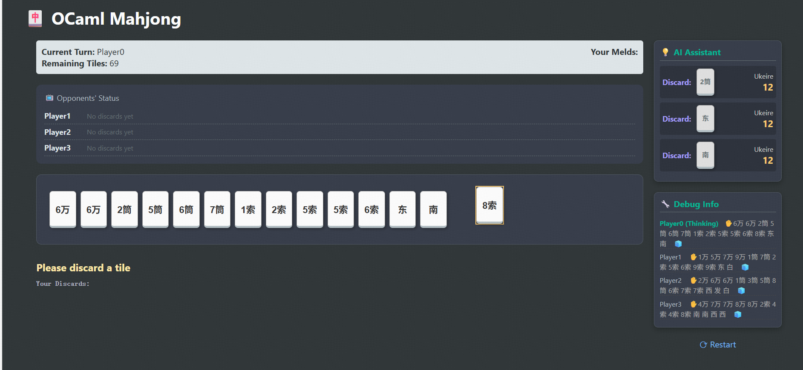
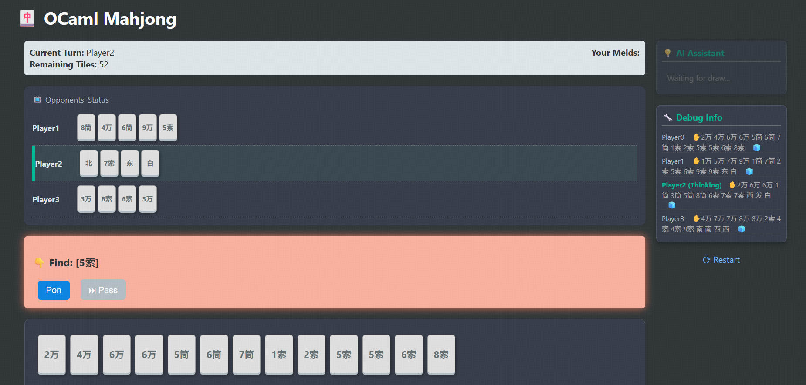
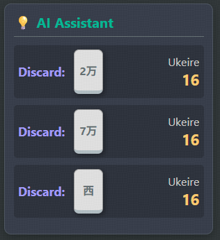
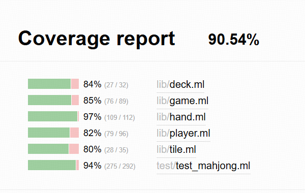

# ocaml_mahjong

Zeli Ma, Jiewen Luo, Jin Zhou

Japanese mahjong implemented with ocaml, for FPSE 2025Fall

## Project Overview

This project aims to develop a comprehensive Japanese Mahjong application using OCaml. The primary goal is to build a game engine that correctly implements the complex rules of Riichi Mahjong.

A core feature of this project is an advanced AI and analysis module. This module will be powered by an A* search algorithm designed to evaluate hand efficiency (i.e., *shanten*, or steps to a winning hand) and determine the optimal discard choice in any given situation.

The final application will serve multiple purposes:

* **AI Opponents:** Different difficult levels AI to play against.

* **A Training Tool:** A system to analyze player decisions and provide optimal play recommendations.
* **library:** ounit2,dream,core
### Basic Game Concepts

* **Riichi Mahjong**  
  A Japanese variant of Mahjong, usually played by 4 players. Each player draws and discards tiles, trying to form a complete hand (similar to making sets in rummy).

* **Hand / Winning Hand**  
  A Mahjong **hand** is the set of tiles a player holds.  
  A **winning hand** usually consists of:
  * 4 **melds** (sets) + 1 **pair** (two identical tiles),  
    for example: 3-4-5 of the same suit (a sequence) or 7-7-7 (a triplet), plus one pair like 2-2.

* **Meld**  
  A group of 3 or 4 tiles that form a valid set:
  * **Sequence (shuntsu)** – three consecutive numbers in the same suit (e.g., 3-4-5 of circles).
  * **Triplet (koutsu)** – three identical tiles (e.g., 7-7-7 of bamboo).
  * **Quad (kan)** – four identical tiles (e.g., 9-9-9-9 of characters).

* **Tatsu**  
  An **incomplete set** that is one tile away from becoming a meld.  
  Examples:
  * A **sequence wait**: 2-3 of a suit (needs 1 or 4 to become 1-2-3 or 2-3-4).
  * A **pair-like wait**: 5-5 (needs another 5 to become a triplet).

### Key Japanese Action Terms

These actions are available when certain tiles are discarded or drawn:

* **Chi (chii)**  
  Calling a sequence from the **player on your left** using their discard.  
  Example: You have 3-4 of circles, the player on your left discards 5 of circles → you can call **chi** to make 3-4-5.

* **Pon**  
  Calling a **triplet** from any player’s discard.  
  Example: You have two 7 of bamboo, someone discards another 7 of bamboo → you can call **pon** to make 7-7-7.

* **Kan**  
  Making a **quad (four of a kind)**. This can come from:
  * Upgrading a triplet you already have when you draw the 4th tile, or
  * Calling on another player’s discard if you have three copies.

* **Tsumo**  
  Winning by drawing the winning tile **yourself** from the wall.

* **Ron**  
  Winning by claiming a tile **discarded by someone else**.

These are the buttons you see in the UI: `chi`, `pon`, `kan`, `tsumo`, and `ron`.

### Tile Types and Names

Japanese Mahjong uses tiles instead of playing cards. There are 34 unique tile types, with 4 copies of each (136 tiles total). They are grouped into:

* **Numbered Suits (1–9 in each suit):**
  * **Characters / Manzu (“man”“万”)** – often written with Chinese numerals (一 to 九).  
    Example: “1-man”, “9-man”.
  * **Circles / Pinzu (“pin”“筒”)** – circles/dots.  
    Example: “3-pin”, “7-pin”.
  * **Bamboo / Souzu (“sou”“索”)** – sticks/bamboo.  
    Example: “2-sou”, “6-sou”.

* **Honor Tiles:**
  * **Winds:** East“东”, South“南”, West“西”, North“北”.
  * **Dragons:** White“白”, Green“发”, Red“中”.

In code, we treat each unique tile (e.g., 3-pin, East wind) as an element in a fixed list of 34 tile types and store how many copies you have.

### Shanten, Tenpai, and Ukeire

These are key concepts for our AI and analysis tools.

* **Shanten**  
  *Shanten* is “how many steps away from a winning hand” you are.  
  * **shanten = 0** → your hand is in **tenpai**, one tile away from winning.  
  * **shanten = 1** → you need at least 2 more tile improvements to win, and so on.  
  * If you are already winning, the shanten value can be thought of as -1.

  Our algorithm computes this number for the current hand.

* **Tenpai**  
  A hand that is **ready**—it only needs one more tile to win (shanten = 0).

* **Ukeire (effective tiles)**  
  Literally “accepted tiles.”  
  For a given hand, **ukeire** is the **set and count of tiles that improve your hand**:
  * Given your current tiles, we imagine drawing each possible tile type.
  * If drawing that tile reduces shanten, it is an **effective tile**.
  * The total number of such tiles still left in the wall is the **ukeire count**.
  * A higher ukeire count = more ways to improve your hand = “better efficiency.”

Our AI uses **ukeire** to rank discards: it recommends discarding the tile that leaves you with the highest ukeire count.

## How to play

* `dune exec bin/main.exe` to start, run on localhost:3000
* Click cards to display, click operation buttons to perform `chi`, `pon`, `kan` `tsumo` and `ron`
* Play with 3 AI-bots who can only draw and play what they just draw like a dummy 

* Basic instruction on "AI assistant" to tell you what is the best choices of discard

* To test the new frontend, use `npx http-server . -p 8080` and run on http://127.0.0.1:8080

## Finished functions

* Based on the `.mli` files, develop basic structure including fundamental functions: `draw`, `play` (discard), and `win` (basic win check) and operations: `chi`, `pon`, `kan` and `ron`.
* Basic frontend interface written with `HTML` and `Dream`
* A complex algorithm to calculate "Shanten" and tile efficiency, which give player recommendation on what to discard by showing the contribution to Shanten

## Implementation

### Backend

* All game logic is encapsulated in the `Mahjong` library, ensuring it is reusable and testable without the frontend.
* **tile** defines basic type of Mahjong cards and implement operations like `compare` and `to_string` for usage
* **deck** defines the deck, where player draw cards. It handles create, shuffle and draw operations
* **hand** implements the functions of cards in one player's hand. It also calculate `shanten` (distance to build a hand which can win) and the efficiency of each card, which can give instruction to player to play the best card. It is implemented by traversing all mahjong card types and performing a recursive depth-first search (DFS) to find possible combinations.
  * **Algorithm**:
      The core of our AI and assistance system is a **recursive backtracking algorithm** that calculates *shanten* (minimum moves to win) and *ukeire* (tile acceptance). The process follows these steps:

      1.  **Shanten Calculation (Standard Form)**:
          * The algorithm converts the hand into a **frequency table** (array of tile counts).
          * It first attempts to identify a pair (the "head").
          * It then performs a **Depth-First Search (DFS)** to extract all possible *melds* (sequences or triplets).
          * After extracting melds, a **greedy strategy** counts the remaining *tatsu* (incomplete sets like `2-3` or `2-2`).
          * The final shanten value is derived using the standard formula: $8 - (2 \times \text{Melds} + \text{Tatsu} + \text{Pair})$.
          * It simultaneously calculates the shanten for a headless hand (single wait) and takes the minimum.

      2.  **Ukeire (Effective Tile) Calculation**:
          * Given a 13-tile hand, the system iterates through all 34 unique Mahjong tiles.
          * For each tile, it simulates drawing it and recalculating the shanten.
          * If the shanten **decreases**, the tile is considered "effective."
          * The total count of effective tiles is summed (assuming 4 of each exist, minus visible ones in hand).

      3.  **Efficiency Ranking**:
          * For a 14-tile hand, the system iterates through every unique tile in the hand.
          * It simulates discarding each tile and calculates the resulting *ukeire* of the remaining 13 tiles.
          * Discards are ranked by this count, recommending moves that maximize the probability of advancing the hand.
  * Apply the algorithm to have the same performance like https://mj.fyisvia.com/discard and test.py
* **Player** defines the player type with hands and melds(the result of `chi` `pon` `kan`)and the operations player can do, including fundamental functions: `draw`, `play` (discard), and `win` (basic win check) and operations: `chi`, `pon`, `kan` and `ron`.
* **Game** is the core controller of the whole project. It control the turn change of 4 players, and manage the behavior of player and deck.

### Frontend（functional one)

* **bin/main** : Write HTML to call functions from backend. The `main` file manages the creation of a game, the connection between `HTML` frontend and `Ocaml` backend(by `HTML` action and `Dream` routes ), and all the behavior of game.
## New Frontend Progress (The new frontend is **not fully functional yet** — it’s still under development!）(All code in "front_maj" file)

This section documents the current status of a standalone frontend prototype (HTML/JS), used for experimenting with layout and interaction before fully wiring it to the OCaml backend.

### What’s working

- Four-player layout on green table with enlarged south hand, opponent backs, dora panel, wall counter, discard piles per seat.
- Player flow: draw ➜ select tile ➜ discard; auto-sort by suit/number; win/Rong modal showing full 13 tiles (hand + draw slot + melds) with enlarged visuals.
- Actions bar (Chi/Peng/Rong/Skip) appears on mocked triggers; Chi/Peng move opponent discard + two of your tiles into meld area; Rong shares the Win modal.
- Meld area pinned to south hand; draw slot holds the just-drawn tile until discarded/merged.
- Discard piles oriented per seat (rotation) with consistent spacing.

### Mocked assumptions (no backend yet)

- Tile scores: random 0–100 via `fetchTileScore` mock.
- Win check: always `true` via `checkWinCondition`.
- Action availability: `fetchActionOptions` returns Chi/Peng/Rong enabled only on every 5th AI discard turn (toggle stub).
- Meld composition: Chi/Peng randomly pulls two tiles from player hand plus last opponent discard; real logic to be driven by backend.
- Win summary text: static placeholder from `fetchWinSummary`.

### Backend hook points

- `api.js`
  - `fetchTileScore(handTiles)` → replace with real scoring API (expects map: `tileId → score`).
  - `checkWinCondition(handTiles)` → real win/ron check.
  - `fetchActionOptions(turnIndex)` → real Chi/Peng/Rong availability per discard context.
  - `fetchWinSummary()` → real win description/points.
- Rendering/flow touchpoints in `main.js`
  - Scores refreshed after draw/discard/meld via `refreshScores`.
  - Action buttons shown in `promptAction` based on `fetchActionOptions` result.
  - Meld handling in `performMeld` (replace random picks with backend-dictated tiles).
  - Win modal fed by `openWinModal(getFullTilesForWin())`.
  - Sorting via `sortTiles` (`utils.js`) already used whenever south hand renders.

## TODO

* Implement complex rules on score calculation. Current version can only let people know they win or not.
* Implement better algorithms (like A*) to calculate card efficiency and generate instruction. Current version use Brute-force algorithm and only consider player's hand.
  * Apply the algorithm on AI-bots, who can play much better and even easily win human players.
* Optimize and keep development of the new frontend.
* Link the new frontend to the backend.
  
## Tests

* We already implement tests on our lib, and get overall coverage more than 90%.

