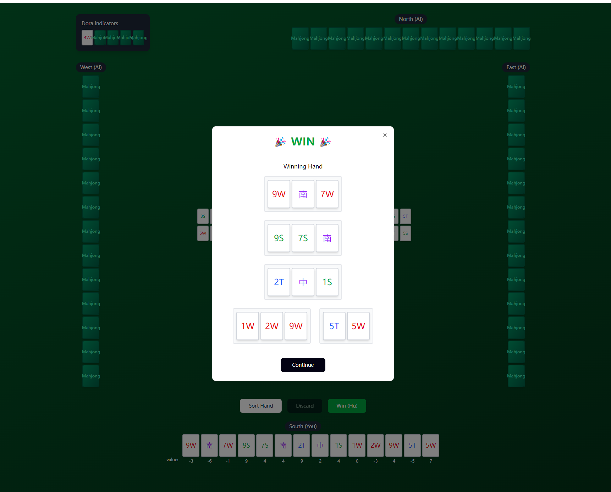

# Japanese Mahjong

## Section I. Project Overview

This project aims to develop a comprehensive Japanese Mahjong application using OCaml. The primary goal is to build a game engine that correctly implements the complex rules of Riichi Mahjong.

A core feature of this project is an advanced AI and analysis module. This module will be powered by an A* search algorithm designed to evaluate hand efficiency (i.e., *shanten*, or steps to a winning hand) and determine the optimal discard choice in any given situation.

The final application will serve multiple purposes:
* **AI Opponents:** Different difficult levels AI to play against.
* **A Training Tool:** A system to analyze player decisions and provide optimal play recommendations.

## Section II. Core UI Layout and Demo Flow

This section details the primary user interface and the step-by-step user flow intended for the demo.

### A. Main Game Board Layout

The board is presented from the perspective of the human player (South).

* **Player Positions:**
    * **South (You):** Bottom of the screen. Hand tiles are face-up.
    * **North, East, West (AI):** Top, right, and left. Hand tiles are face-down.
* **Player Area (South):**
    * Displays the 13-tile hand.
    * Action Buttons: `Sort Hand`, `Discard`, and `Win (Hu)` are located above the hand.
    * Card Values: There is a value below each tile, which are generated from our searching algorithm.
* **Center Area:**
    * **Wall:** Shows the count of remaining tiles (e.g., "Remaining: 12").
    * **Discard Piles:** Each player's discards are placed in the center, forming a cross layout.
* **Dora Area:**
    * Located in the top-left, showing five tiles, with one (the indicator) flipped face-up.
* **Tile Suits:**
    * **Characters (W)**
    * **Dots (T)**
    * **Bamboos (S)**
    * **Honors (Charcter)**

### B. Work Flow  and Demo Sequence

This flow describes the player's turn from start to finish.

**1. Initial State:**
* All players have 13 tiles.
* The Wall shows "Remaining: 12".
* The `Discard` and `Win (Hu)` buttons are **disabled**.

**2. Player Draws a Tile:**
* **Trigger:** The player's turn begins.
* **Action:** The system automatically draws one tile from the Wall.
* **UI Update:**
    * The player's hand temporarily shows 14 tiles (the new tile is highlighted).
    * The Wall count decreases to "Remaining: 11".
    * The `Discard` and `Win (Hu)` buttons become **active**.

**3. Player Discards a Tile:**
* **Trigger:** The player clicks a tile from their 14-tile hand.
* **Action:** The selected tile is moved to the South discard pile.
* **UI Update:** The hand returns to 13 tiles.

**4. Player Sorts Hand (Optional):**
* **Trigger:** The player clicks the `Sort Hand` button.
* **Action:** The hand tiles are re-ordered by suit (W, T, S, Honors).

### C. Win Modal

This screen appears when the player successfully declares a win.

* **Trigger:** Player clicks the `Win (Hu)` button when a winning condition is met.
* **UI Update:**
    * A modal window appears in the center of the screen.
    * **Title:** "WIN"
    * **Content:** The player's full 14-tile winning hand is displayed, grouped into sets (melds) and the pair.
    * **Action:** A `Continue` button is present to proceed to the next round or end the game.

### D. Video Demo and Self Try

To better understand how our project demo works, please see the video demonstration of this demo:
[video](https://github.com/)

If you want to play this Demo, use the link: 
[game demo](https://www.figma.com/make/CWq7Ro1bW6odSBQo6PaTHC/Mahjong-Game-Board-Design?t=EORSMmgzoY9myjdc&fullscreen=1)

## Section III. Core Algorithm

### A*-Based Hand Efficiency Evaluation in Mahjong

In this project, one of the most important components is the hand-efficiency evaluation module, which estimates how close a player’s hand is to a winning state and determines the optimal tile to discard.

To achieve efficient and accurate evaluation, we employ the A* search algorithm to model Mahjong decision-making as a heuristic graph search problem. Each hand configuration is represented as a node, and each action — such as drawing or discarding a tile — corresponds to a state transition. The objective is to find the minimal sequence of actions that leads from the current hand to a valid winning hand.

The algorithm evaluates each state using the A* cost function:
$$f(n) = g(n) + h(n)$$

where $g(n)$ denotes the actual number of steps (draws/discards) taken from the current hand, and $h(n)$ is an estimated *shanten* number that measures how far the hand is from completion. This design allows the algorithm to prioritize states that are both close to the goal and have a promising potential for improvement.

In practice, this module can be applied in several scenarios:
* **AI decision-making:** The system simulates possible discard choices, runs A* search to evaluate each option’s expected time-to-win, and recommends the discard with the lowest expected cost.
* **Training and analysis tools:** The module can analyze historical games or user inputs to visualize how hand efficiency evolves under optimal play.
* **Game balancing and difficulty tuning:** By adjusting heuristic weights, the system can model players of different skill levels.

Implemented in OCaml, this algorithm benefits from the language’s immutable data structures, expressive pattern matching, and powerful type system. Each search node (a hand state) can be represented as an immutable record, while priority queues manage the frontier efficiently. Recursive functions with memoization and tail-call optimization enable exploring thousands of potential hand evolutions per second.

Furthermore, OCaml’s native code compiler provides performance comparable to C while preserving safety guarantees. With accurate heuristics and pruning strategies, the A*-based module can deliver near real-time results (<100 ms per decision) in typical Mahjong scenarios, providing a balance between optimality, interpretability, and efficiency. This makes it a practical core for Mahjong AI systems, training simulators, and interactive analysis tools.

## Section IV. Libraries

We will use Core and Dream in our project. Core has already proved to work well. 

A Dream demo, which is a basic version of our mahjong, is added to `demo/`. 

## Section V. Module Type Declarations (.mli files)

All module interfaces are located in the `lib/` directory of the main project.

## Section VI. Implementation Plan

### Week 1: Basic Game Engine (Nov 12 - Nov 18)

* **Goal:** Implement basic Mahjong mechanics and partial complex rules.
* **Tasks:**
    * Implement fundamental functions: `draw`, `play` (discard), and `win` (basic win check).
    * Add operations: `chi`, `pon`, and `ron`.
    * Implement initial scoring patterns to calculate the final score.

### Week 2: AI Algorithm and Rules Completion (Nov 19 - Nov 25)

* **Goal:** Finalize rule design and implement the core AI search algorithm.
* **Tasks:**
    * Finish the complete design and implementation of Mahjong rules.
    * Implement the A* searching algorithm to calculate "card value" (the contribution to a winning hand pattern when discarding a specific tile).
    * Integrate this algorithm to provide recommendations for human players and as the core logic for AI players.

### Week 3: Frontend Interface and Testing (Nov 26 - Dec 3)

* **Goal:** Develop the user interface and ensure project stability.
* **Tasks:**
    * Finish the frontend (GUI) design.
    * Allow players to play a full game using the graphical interface.
    * Conduct comprehensive testing and debugging, aiming for high test coverage.

## Section VII. Additional Information

Japanese Mahjong Rules Reference:
[Japanese Mahjong WiKi](https://en.wikipedia.org/wiki/Japanese_mahjong)